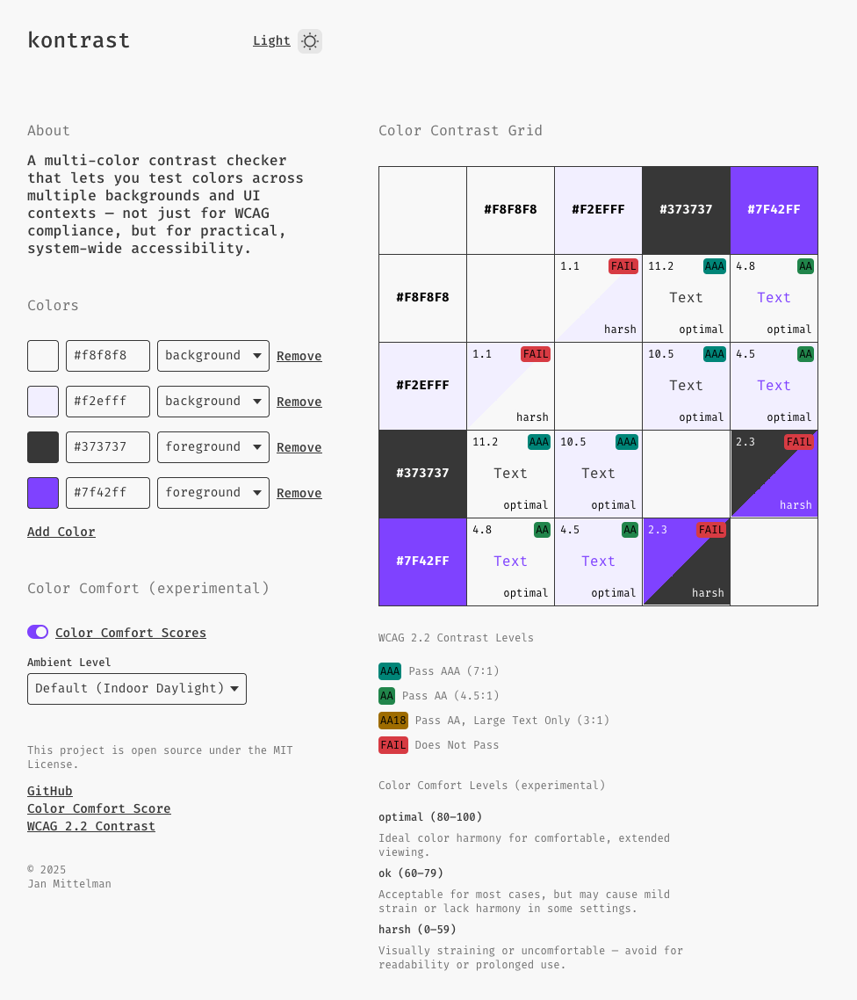

# kontrast – Universal Contrast Checker

A **minimal**, **multi-context** color contrast tool — built to test a color against light backgrounds, dark backgrounds, and secondary UI elements in real time. Designed to answer a simple, but often neglected question:

👉 _“Can this one color work everywhere?”_

Try it live at [kontrast.app](https://kontrast.app) – no sign-up, no clutter.

---

## ✨ Why kontrast?

Most contrast checkers only let you compare **two colors at a time** – foreground vs background. That’s great for checking _compliance_, but not for picking _colors that actually work across your whole UI_.

I built **kontrast** because I couldn’t find a single tool that let me:

- Test one color against both **light and dark backgrounds**
- See how it contrasts with a **secondary color**
- Tweak all of them **live** and get instant WCAG feedback
- Understand not just ratios — but _relationships_

### 🆚 How it's different

- 🧠 Designed for **design systems**, not just developers
- 🎯 Helps find **universal colors** for theming (light/dark)
- ⚡ Instant WCAG contrast updates (AA/AAA) across all comparisons
- 🧪 Built for **real-world UI decisions**, not just box-checking

---

## 🛠️ Features

🎨 **Three-Way Color Comparison**  
Pick a **primary**, **secondary**, and **background color** — see how all pairs perform.

🌗 **Dual Theme Support**  
Test against both **light** and **dark** backgrounds simultaneously.

📏 **Live WCAG Evaluation**  
Every contrast pair updates instantly with WCAG 2.1 compliance labels.

🎛️ **Tweak Everything**  
Use sliders, hex inputs, or color pickers — changes are reflected immediately.

🔢 **Contrast Ratios**  
See the exact contrast ratio for each comparison, not just pass/fail.

💡 **Smart Suggestions** _(coming soon)_  
Get nearby color suggestions that pass contrast while staying visually close.

---

## 🧰 Tech Stack

- [React](https://reactjs.org/)
- [TypeScript](https://www.typescriptlang.org/)
- [Vite.js](https://vitejs.dev/)
- [Redux Toolkit](https://redux-toolkit.js.org/)
- [@emotion/react](https://emotion.sh/docs/introduction)
- [Chroma.js](https://gka.github.io/chroma.js/) – Color math & contrast

---

## 📦 Getting Started

```bash
# Clone the repo
git clone https://github.com/vedmakk/kontrast.git
cd kontrast

# Install dependencies
bun install

# Start development server
bun run dev
```

## 📜 License

This project is licensed under the MIT License — use freely, modify openly, and share widely.  
See the [LICENSE](LICENSE.md) file for full details.

The Fira Code font is included under the terms of the SIL Open Font License, Version 1.1.  
See the [Fira Code License](src/theme/fonts/woff2/LICENSE) for more information.
